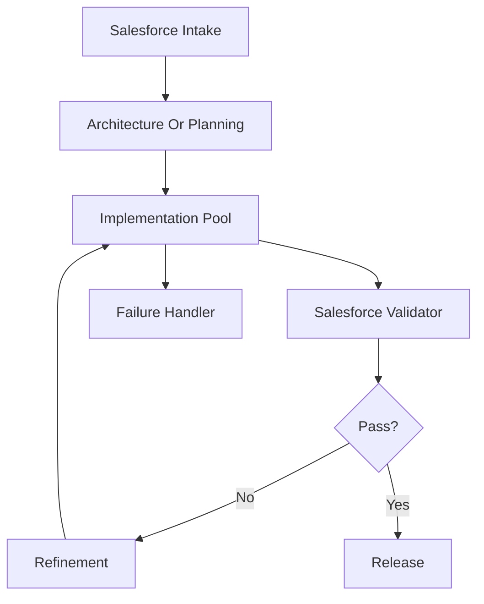

# Salesforce Multi-Agent Compact

Use this skill when the user wants Salesforce multi-agent design with minimal tokens.

## Goal

Return a production-safe Salesforce multi-agent design in compact form.

Default target:

- 4 to 6 agents
- one main execution path
- one validation loop
- one escalation path
- one Mermaid flowchart

## Output Shape

Return only:

1. `Task`
2. `Agents`
3. `Routing`
4. `Salesforce Gates`
5. `Fail`
6. `Scale`
7. `Flowchart`

## Agent Format

For each agent, give only:

- `Name`
- `Role`
- `Input`
- `Output`
- `Rule`

## Default Salesforce Agent Pattern

Use this baseline unless the task demands a different shape:

- Intake
- Architecture Or Planning
- Implementation Pool
- Salesforce Validator
- Refinement
- Release

Implementation pool may include one or more of:

- Apex
- LWC
- Flow
- Integration
- Security
- Deployment

Keep the pool abstract unless specialization materially matters.

## Compression Rules

- do not invent org-specific facts
- use one best architecture path
- prefer 4 to 6 agents
- combine roles when possible
- keep each line short
- mention only material Salesforce risks

## Salesforce Gates

Include only relevant checks:

- Flow vs Apex choice
- bulk safety
- CRUD/FLS/sharing
- recursion or automation overlap
- async suitability
- integration retry or idempotency
- deployment impact

## Failure Handling

Cover only high-value failures:

- missing org or metadata context
- implementation failure
- validation failure

For each, give:

- detect
- retry or fallback
- escalate

## Scale

Mention only:

- parallel workstreams
- queue or async boundary
- artifact store or audit trail
- API or middleware rate limits

## Flowchart

Always include one compact Mermaid diagram.

Use this pattern:

## Style

- terse
- org-agnostic unless evidence is provided
- implementation-first
- no long explanation
