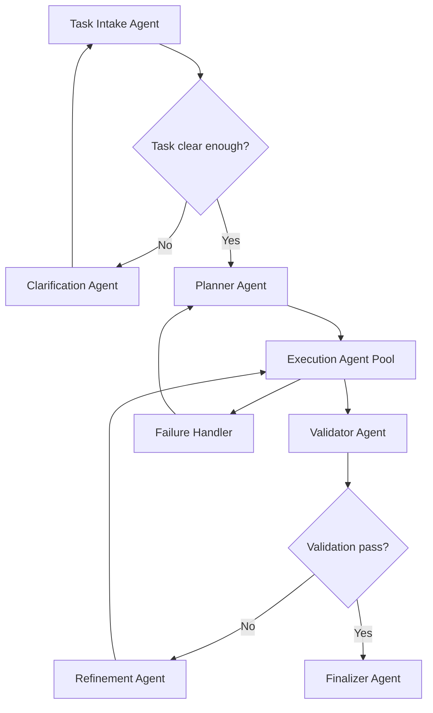

# Multi-Agent Architect

Design a multi-agent system that is clear enough to implement, not just admire.

## Goal

Produce a complete multi-agent workflow for a target task with:

- agent roles
- inputs and outputs
- routing rules
- validation gates
- feedback loops
- failure handling
- optimization steps
- scalability design
- implementation-ready flowchart

## Default Output Structure

Always return these sections:

1. `Task`
2. `Assumptions`
3. `Agents`
4. `Routing Logic`
5. `Validation And Feedback Loops`
6. `Failure Handling`
7. `Optimization`
8. `Scalability`
9. `Flowchart`
10. `Implementation Notes`

## Agent Definition Format

For each agent, define:

- `Name`
- `Role`
- `Inputs`
- `Outputs`
- `Decision logic`
- `Success criteria`
- `Failure conditions`

## Design Rules

### 1. Separate control from execution

Unless the task is trivial, include:

- intake or orchestrator agent
- planner or decomposition agent
- execution agent or execution pool
- validator or reviewer agent
- refinement or retry agent
- finalizer agent

### 2. Make routing explicit

Do not say "the task is passed to another agent" without defining:

- what condition triggers the handoff
- what artifact is passed
- what the next agent is allowed to change

### 3. Add feedback loops only where they improve correctness

Every loop must have:

- a trigger
- a maximum retry or escalation rule
- a clear exit condition

Avoid infinite refinement loops.

### 4. Validate before completion

Include at least one validation stage that checks:

- task completeness
- correctness against requirements
- output quality or policy constraints

### 5. Handle failure explicitly

Always define:

- recoverable failures
- unrecoverable failures
- escalation path
- timeout or retry policy

### 6. Design for real workloads

Include:

- concurrency boundaries
- queue or work-batch strategy
- observability signals
- cost or latency optimization

## Standard Agent Set

Use this as the default baseline unless the task clearly needs a different structure.

### Intake Agent

- receives task
- extracts objectives, constraints, and ambiguity
- routes to clarification if confidence is too low

### Clarification Agent

- resolves missing requirements
- normalizes scope and assumptions
- returns a clarified task artifact

### Planner Agent

- decomposes task into work units
- assigns work type and ordering
- selects serial versus parallel execution

### Execution Agent Pool

- performs the actual work
- may be specialized by function
- returns output plus evidence

### Validator Agent

- checks requirements, quality, and consistency
- either approves or returns structured defects

### Refinement Agent

- turns validation defects into targeted rework instructions
- sends only the required delta back to execution

### Finalizer Agent

- assembles approved outputs
- formats final deliverable
- publishes completion metadata

## Decision Logic Pattern

Prefer explicit conditions like:

- if confidence `< threshold`, route to clarification
- if task is decomposable, route to planner
- if work units are independent, route to parallel execution
- if validation fails and retry budget remains, route to refinement
- if retry budget is exhausted, escalate to failure handler or human review

## Failure Handling Template

Always cover:

- `Input failure`
  invalid, incomplete, contradictory input
- `Execution failure`
  timeout, tool error, missing dependency, low-confidence output
- `Validation failure`
  incomplete, incorrect, unsafe, inconsistent output
- `System failure`
  overloaded queue, unavailable service, dead-letter scenario

For each, define:

- detection method
- retry or fallback
- escalation target

## Optimization Template

Consider:

- caching repeated context or plans
- batching similar work
- parallelizing independent tasks
- shrinking context passed between agents
- separating expensive validation from cheap screening
- using confidence thresholds to reduce unnecessary loops

## Scalability Template

Always mention the relevant items:

- horizontal scaling of execution agents
- work queue design
- rate limiting
- idempotency
- state store or artifact store
- audit trail
- monitoring and alerting

## Flowchart Rules

Always include Mermaid.

Use this shape:

Adapt the labels to the user task, but preserve the control logic.

## Implementation Notes

End with implementation guidance:

- orchestration model
- state handoff format
- logging and metrics
- retry budget
- stopping conditions

## Style

- be concrete
- prefer structured bullets over theory
- do not hide routing logic in prose
- make the result implementation-ready
