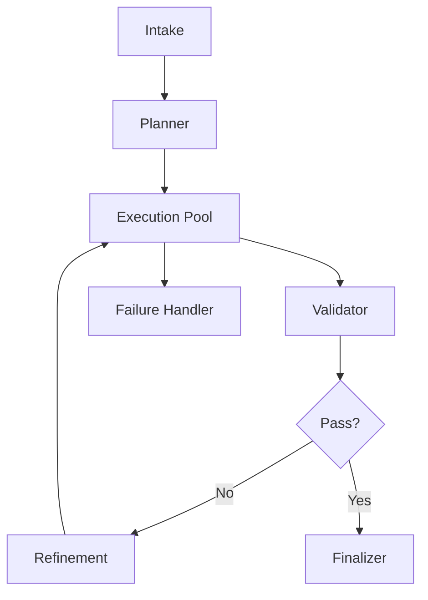

# Multi-Agent Compact

Use this skill when the user wants multi-agent system design with the fewest useful tokens.

## Goal

Return an implementation-ready multi-agent design while minimizing output size.

Default target:

- 4 to 6 agents
- one primary path
- one validation loop
- one failure path
- one Mermaid flowchart

## Output Shape

Return only:

1. `Task`
2. `Agents`
3. `Routing`
4. `Validate`
5. `Fail`
6. `Scale`
7. `Flowchart`

## Agent Format

For each agent, give only:

- `Name`
- `Role`
- `Input`
- `Output`
- `Rule`

Do not add long theory.

## Compression Rules

- Prefer 4 to 6 agents unless complexity clearly requires more.
- Combine adjacent roles when separation adds little value.
- Use one best design, not multiple options.
- Keep each agent to one short bullet line when possible.
- Keep routing logic explicit but terse.
- Include only one retry or refinement loop unless more are essential.

## Default Agent Pattern

Use this baseline unless task shape clearly differs:

- Intake
- Planner
- Execution Pool
- Validator
- Refinement
- Finalizer

If task is simple, merge Planner and Intake or merge Refinement into Validator.

## Decision Rules

Prefer short routing like:

- unclear input -> clarification
- decomposable task -> planner
- independent work -> parallel execution
- failed validation -> refinement
- retry exhausted -> escalation

## Failure Handling

Cover only:

- input failure
- execution failure
- validation failure

For each, give:

- detect
- fallback or retry
- escalation

## Scalability

Mention only the highest-value items:

- parallel workers
- queue
- idempotency
- logs or audit trail

## Flowchart

Always include one compact Mermaid diagram.

Use this pattern:

## Style

- terse
- implementation-first
- no extra explanation unless needed for correctness
