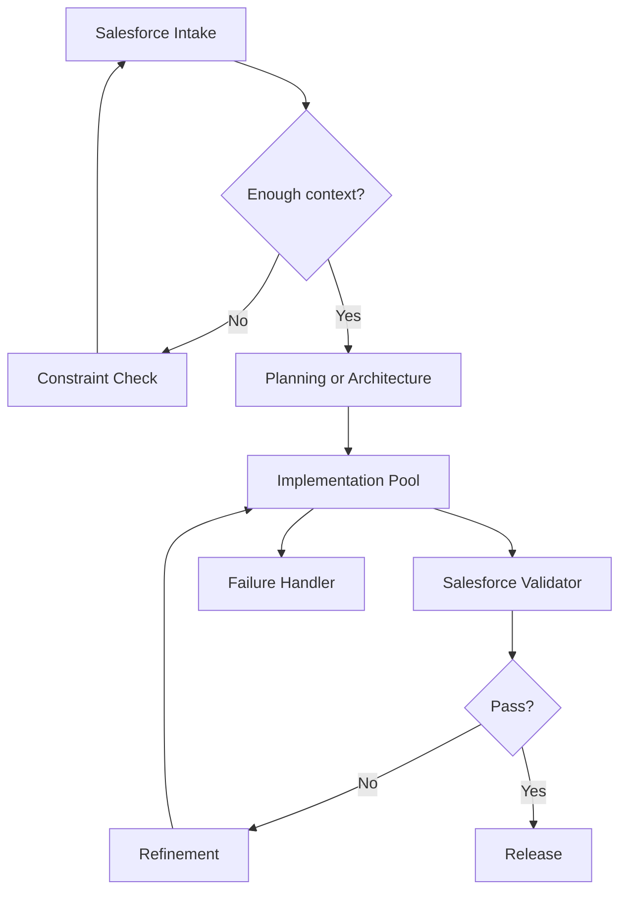

# Salesforce Agent Mode

Use this skill for Salesforce multi-agent system design with compact output and strict evidence discipline.

## Goal

Return a production-safe Salesforce multi-agent design that:

- minimizes token use
- avoids org-specific hallucination
- keeps only the material agents and loops
- stays implementable in real delivery
- can be used as an execution blueprint for parallel worker agents

## Default Output

Return only:

1. `Task`
2. `Assumptions`
3. `Agents`
4. `Routing`
5. `Salesforce Gates`
6. `Fail`
7. `Scale`
8. `Flowchart`

## Default Shape

Prefer:

- 4 to 6 agents
- one main execution path
- one validator
- one refinement loop
- one escalation path

Expand only if the task truly needs more specialization.

For execution-oriented coding tasks, prefer 3 to 5 agents.

For large-file review tasks, prefer:

- 1 coordinator
- 2 to 4 chunk reviewers
- 1 validator or merge agent

## Agent Format

For each agent, give only:

- `Name`
- `Role`
- `Input`
- `Output`
- `Rule`

## Default Agent Pattern

Use this baseline unless the task demands a different split:

- Intake
- Planning Or Architecture
- Implementation Pool
- Salesforce Validator
- Refinement
- Release

Implementation Pool may include:

- Apex
- LWC
- Flow
- Integration
- Security
- Deployment

Keep the pool abstract unless specialization materially changes the design.

## Execution Bias

When the user wants speed, lower token use, or faster completion:

- minimize planner verbosity
- split only independent work
- prefer narrow implementer lanes over many agents
- use one shared validator instead of many reviewers
- return the execution order, not a long theory section

For coding and delivery tasks, prefer:

- Planner
- 1 to 3 Implementation Lanes
- Validator
- Release

For large class review or security review, prefer:

- Coordinator
- Chunk Review Lanes
- Merge Or Validator

Chunk Review Lanes should split by logical region such as:

- public entry methods
- query and DML region
- async or integration region
- helpers or utility methods

Never split by arbitrary line count when that would break control-flow context.

## Evidence Rules

Classify important claims as:

- `confirmed`
- `inferred`
- `unsupported`

Rules:

- do not invent org metadata, package behavior, limits, or release assumptions
- flag missing org context instead of filling gaps with guesses
- if the design depends on unsupported org facts, say so directly

## Routing Rules

Make these explicit when relevant:

- Flow vs Apex
- LDS/UI API vs Apex controller
- sync vs async
- direct integration vs middleware
- when to stop and ask for metadata, logs, screenshots, or schema details
- which parts can run in parallel versus which must stay on the critical path
- when a large class should be chunked into method clusters for parallel review

## Salesforce Gates

Include only the relevant checks:

- Flow vs Apex choice
- bulk safety
- CRUD/FLS/sharing
- recursion or automation overlap
- mixed DML if relevant
- record locking risk if relevant
- async suitability
- integration retry or idempotency
- deployment or packaging impact

## Failure Handling

Cover only high-value failures:

- missing org or metadata context
- implementation failure
- validation failure
- operational failure if integrations or async work are involved

For each, give:

- detect
- retry or fallback
- escalate

## Scale

Mention only:

- parallel workstreams
- queue or async boundary
- artifact store or audit trail
- API or middleware rate limits

## Token Rules

- keep each agent description to one short block
- avoid duplicate context between lanes
- reuse one validator instead of repeating checks per lane unless necessary
- do not expand to large swarms unless the task truly needs them
- for large class review, give each lane only its chunk plus a minimal dependency note
- merge duplicate findings centrally instead of letting each lane restate shared issues

## Flowchart

Always include one compact Mermaid diagram.

Use this baseline:

## Style

- compact by default
- implementation-first
- no filler
- no speculative org detail
- expand only when the user clearly wants full architecture depth
